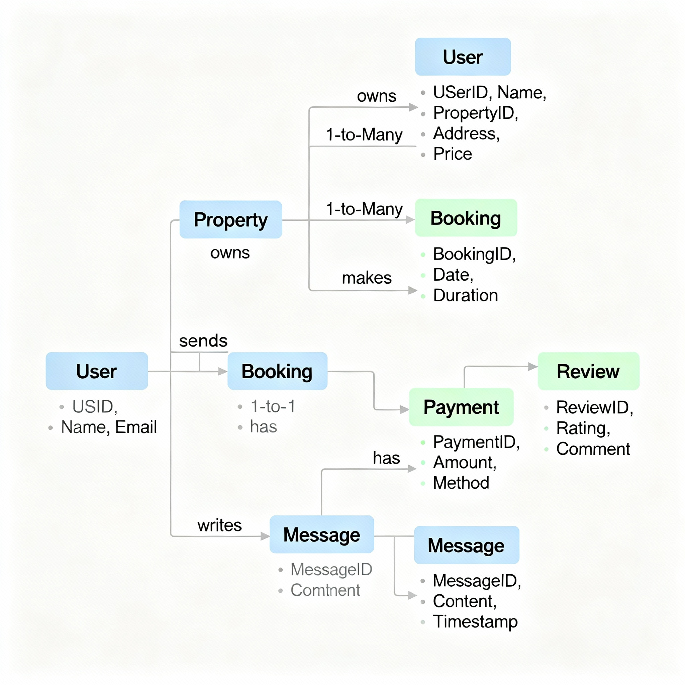

# Entity-Relationship Diagram Requirements

## Project Overview
This document defines the entities and their relationships for the **ALX Airbnb Database Project**.  
It describes the main parts of the data model for clarity and consistency during implementation.

---

## Entities and Attributes

### **User**
- `user_id`: RAW(16), **Primary Key**, Indexed
- `name`: VARCHAR2(100), **NOT NULL**
- `email`: VARCHAR2(100), **UNIQUE**, **NOT NULL**
- `password_hash`: VARCHAR2(100), **NOT NULL**
- `phone_number`: VARCHAR2(20), optional
- `created_at`: TIMESTAMP, default **CURRENT_TIMESTAMP**

---

### **Property**
- `property_id`: RAW(16), **Primary Key**, Indexed
- `host_id`: RAW(16), **Foreign Key**, references `users(user_id)`
- `title`: VARCHAR2(150), **NOT NULL**
- `description`: VARCHAR2(4000)
- `location`: VARCHAR2(100)
- `price`: NUMBER(10,2)
- `created_at`: TIMESTAMP, default **CURRENT_TIMESTAMP**

---

### **Booking**
- `booking_id`: RAW(16), **Primary Key**, Indexed
- `property_id`: RAW(16), **Foreign Key**, references `property(property_id)`
- `user_id`: RAW(16), **Foreign Key**, references `users(user_id)`
- `check_in`: DATE
- `check_out`: DATE
- `total_amount`: NUMBER(10,2)

---

### **Payment**
- `payment_id`: RAW(16), **Primary Key**, Indexed
- `booking_id`: RAW(16), **Foreign Key**, references `booking(booking_id)`
- `amount`: NUMBER(10,2)
- `payment_date`: TIMESTAMP, default **CURRENT_TIMESTAMP**
- `payment_method`: VARCHAR2(20)
- `payment_status`: VARCHAR2(20)

---

### **Review**
- `review_id`: RAW(16), **Primary Key**, Indexed
- `property_id`: RAW(16), **Foreign Key**, references `property(property_id)`
- `user_id`: RAW(16), **Foreign Key**, references `users(user_id)`
- `rating`: NUMBER(1) **CHECK (1 <= rating <= 5)**
- `comments`: VARCHAR2(4000)
- `created_at`: TIMESTAMP, default **CURRENT_TIMESTAMP**

---

### **Message**
- `message_id`: RAW(16), **Primary Key**, Indexed
- `sender_id`: RAW(16), **Foreign Key**, references `users(user_id)`
- `receiver_id`: RAW(16), **Foreign Key**, references `users(user_id)`
- `message_text`: VARCHAR2(2000)
- `sent_at`: TIMESTAMP, default **CURRENT_TIMESTAMP**

---

## Relationships
- **Users** host **Properties**
- **Users** book **Properties**
- **Bookings** reference one **Property** and one **User**
- Each **Booking** has one **Payment**
- **Users** leave **Reviews** for **Properties**
- **Users** send **Messages** to other **Users**

---

## Constraints and Indexes
- Unique constraint on `user.email`
- Foreign key constraints across all relationships
- Review ratings must be between **1** and **5**
- Indexed columns for optimized queries

---

## ER Diagram

